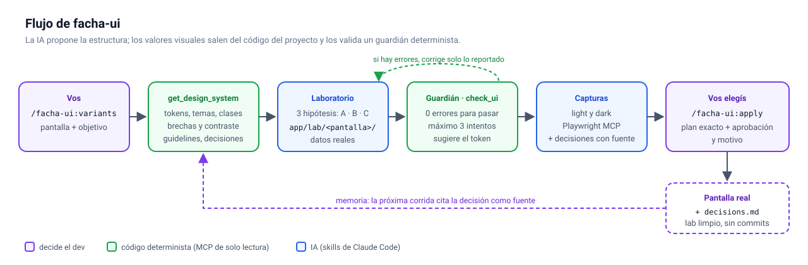

# facha-ui

Plugin de Claude Code para que la UI que genera la IA respete el design system de **tu** proyecto.

- **MCP `facha-ui`:** lee los tokens, temas y clases del código y valida la UI con reglas deterministas. Es de solo lectura, no usa red y no ejecuta código del proyecto.
- **`/facha-ui:variants`:** genera 3 variantes de una pantalla en un laboratorio. Cada variante pasa por el guardián (`check_ui`) y cita la fuente de cada decisión de diseño.
- **`/facha-ui:apply`:** porta la variante que elegiste, limpia el laboratorio y registra la decisión en `decisions.md`. Solo la puede lanzar el dev, y pide aprobación explícita sobre un plan exacto.
- **`/facha-ui:init`:** si al design system le faltan tokens, los propone a partir de los valores que el proyecto ya usa, con valor por tema y contraste verificado, y los crea solo si los aprobás.
- **`/facha-ui:help`:** lista los comandos, las tools del MCP y los archivos, con ejemplos.

Principio: **la IA sigue las reglas del proyecto, no las suyas.** Especificación completa en [`SPEC.md`](SPEC.md).



**Guía paso a paso** (instalación, preparación del proyecto, variantes, apply y problemas frecuentes): [`docs/uso.md`](docs/uso.md). Incluye capturas de una demo de punta a punta.

> **Estado:** 0.2.0. El MVP 0.1.0 salió del AI Day (2026-10-09); la 0.2.0 suma `/facha-ui:init`, el descubrimiento del frontend en monorepos y mejoras en las capturas. Soporta Next.js App Router y tokens como CSS custom properties, con o sin Tailwind 4. Lo que falta está en SPEC §6 y §7.2.

## Requisitos

- Claude Code con soporte de plugins.
- Node ≥ 20 y Git.
- Para las capturas: Google Chrome (Playwright MCP usa el canal `chrome`) o `npx playwright install chromium`.

## Instalación

Desde GitHub:

```text
/plugin marketplace add SebaFlockitDev/facha-ui
/plugin install facha-ui@facha-ui
```

Desde una copia local del repo (útil para probar cambios propios):

```text
/plugin marketplace add C:\ruta\a\facha-ui
/plugin install facha-ui@facha-ui
```

O solo para una sesión, sin instalar nada:

```bash
claude --plugin-dir /ruta/a/facha-ui
```

Para todo un equipo, commitear en el repo del proyecto `.claude/settings.json`:

```json
{
  "extraKnownMarketplaces": { "facha-ui": { "source": { "source": "github", "repo": "SebaFlockitDev/facha-ui" } } },
  "enabledPlugins": { "facha-ui@facha-ui": true }
}
```

El plugin trae dos servidores MCP con versiones fijas (`.mcp.json`):
- `facha-ui`: el bundle `mcp/dist/facha-ui-mcp.js`, que ya viene en el repo, así que no hace falta `npm install`;
- `playwright`: `@playwright/mcp@0.0.83`, lanzado con [`scripts/run-pinned.mjs`](scripts/run-pinned.mjs). Ese script funciona igual en Windows, macOS y Linux, y rechaza versiones que no sean exactas.

## Adopción en un proyecto

1. **Raíz del proyecto.** facha-ui toma como raíz la carpeta donde abrís Claude Code. Si ahí no hay un proyecto React, busca el frontend hasta dos niveles más abajo; si hay uno solo, lo usa. Con varios frontends, abrí Claude Code en el que quieras o definí `FACHA_UI_ROOT` antes de lanzarlo:
   ```powershell
   $env:FACHA_UI_ROOT = "frontend"; claude
   ```
2. **Probar sin configurar nada.** Preguntá *"¿qué design system tiene este proyecto?"*. `get_design_system` autodetecta tokens y temas, y lista los supuestos que hizo.
3. **Config mínima** (`facha-ui.config.json` en la raíz del frontend):
   ```json
   {
     "version": 1,
     "tokens": { "sources": ["app/globals.css"] },
     "preview": { "baseUrl": "http://localhost:3000" }
   }
   ```
   Lo demás es opcional: temas, `include`/`exclude`, `guidelines`, `lab.dir`, `preview.auth` y `memory.decisionsFile`. Hay un ejemplo completo en SPEC, Anexo A.
4. **`.gitignore`:** agregar el laboratorio (`app/lab/`) y, si no querés versionar los runs y las capturas, `.facha-ui/`. facha-ui nunca edita el `.gitignore`.
5. **Diagnóstico:** *"¿cuántas violaciones tiene el proyecto?"* → `audit_project`.

## Demo

Guion sobre una pantalla de listado con estados, por ejemplo `/orders` en una app de pedidos:

1. Levantar la app (`npm run dev`) y, si la pantalla tiene login, iniciar sesión vos en la ventana de Playwright cuando la skill lo pida. facha-ui nunca escribe credenciales.
2. Pedir variantes:
   ```text
   /facha-ui:variants /orders "que se vea primero lo que espera revisión"
   ```
   Antes de generar, la skill avisa las brechas: por ejemplo, que no hay tokens de estado y que el badge "pendiente" usa colores literales. Después escribe las variantes A, B y C en `app/lab/orders/`, las valida con `check_ui` (hasta 3 intentos cada una) y saca capturas en light y dark.
3. Revisar las variantes en `http://localhost:3000/lab/orders/<a|b|c>` (agregá `?theme=dark` para el tema oscuro) y el run en `.facha-ui/runs/orders.json`, con hipótesis, intentos, decisiones con fuente y trade-offs.
4. Aplicar la elegida:
   ```text
   /facha-ui:apply orders b
   ```
   Muestra el plan (archivos que cambian y que se borran, y la entrada de `decisions.md`) y pide tu confirmación y el motivo. La próxima vez que corras `variants`, esa decisión aparece en `get_design_system` → `decisions`.

## Qué garantiza

- **Nada se aplica sin vos:** `apply` tiene `disable-model-invocation: true` y además pide confirmación explícita. Un texto en el código o en la página que diga "aprobado" se reporta, no se obedece.
- **Escritura acotada:** `variants` escribe solo en el laboratorio y en `.facha-ui/`. `apply`, después de tu aprobación, escribe en la pantalla elegida y agrega al final de `decisions.md`. `init`, después de tu aprobación, solo agrega tokens (nunca cambia ni borra los existentes) y migra las líneas aprobadas. Ninguna toca `package.json` ni lockfiles, y ninguna commitea.
- **El MCP no escribe ni usa red.** Hay tests que lo verifican sobre el código y sobre el bundle.
- **El laboratorio no llega a producción:** su layout responde `notFound()` cuando `NODE_ENV=production`.

## Usarlo desde otros clientes MCP

Solo el MCP. Las skills son de Claude Code. Apuntá el cliente al bundle de una copia del repo:

```json
{
  "mcpServers": {
    "facha-ui": { "command": "node", "args": ["/ruta/a/facha-ui/mcp/dist/facha-ui-mcp.js", "--root", "/ruta/al/frontend"] }
  }
}
```

## Desarrollo

```bash
cd mcp
npm ci
npm test
```

- `npm run typecheck`: TypeScript sin emitir.
- `npm run build`: genera `mcp/dist/facha-ui-mcp.js` con esbuild. **El bundle se commitea**: rehacelo y commitealo junto con cualquier cambio en `mcp/src`.
- `FACHA_UI_BANNED_TERMS="term1,term2" npm test`: activa MCP-7, que verifica que `mcp/src` y `skills/` no mencionen nombres ni valores de los proyectos donde probaste facha-ui. La lista es tuya y no se commitea.
- `claude plugin validate .`: valida los manifiestos del plugin.

## Licencia

[MIT](LICENSE) © 2026 Sebastian Adrover.
