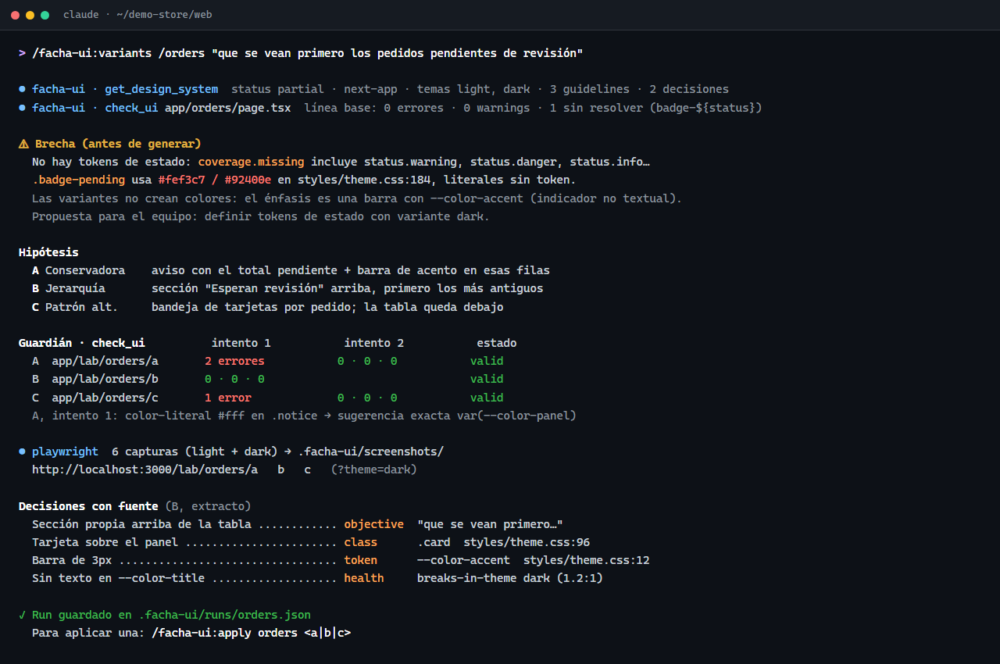
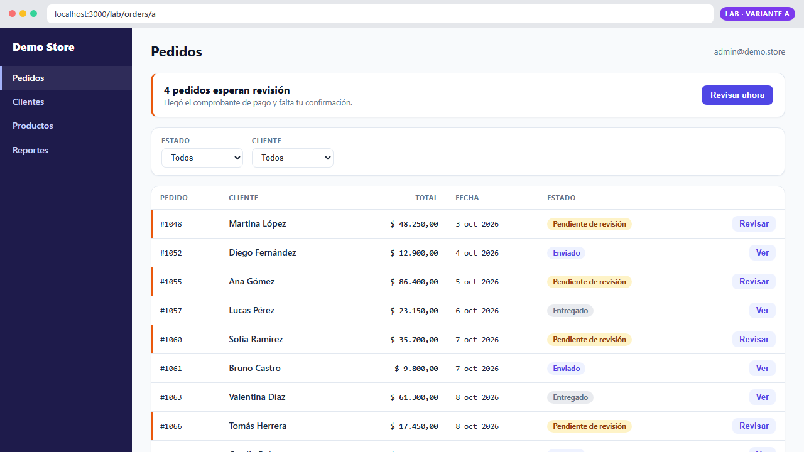
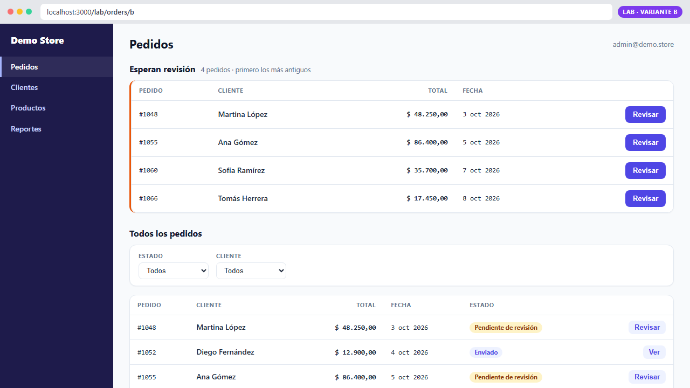
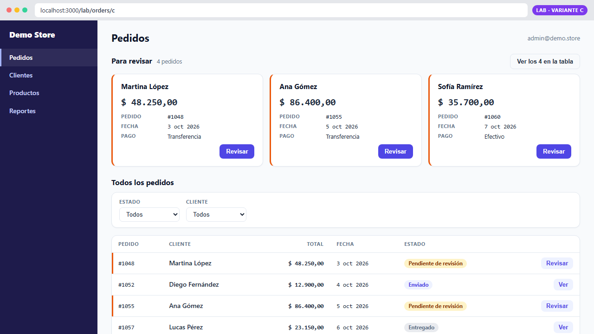
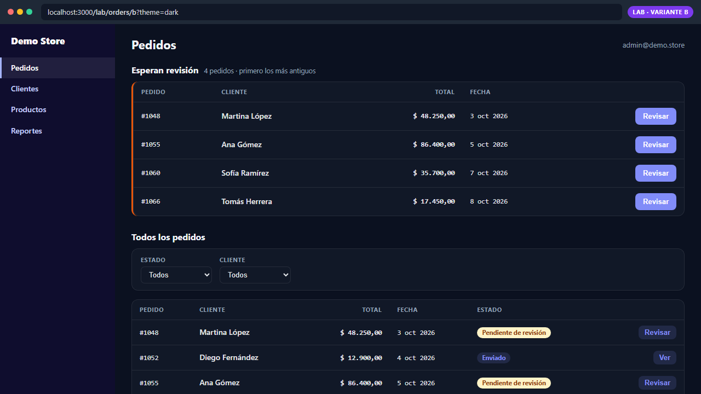
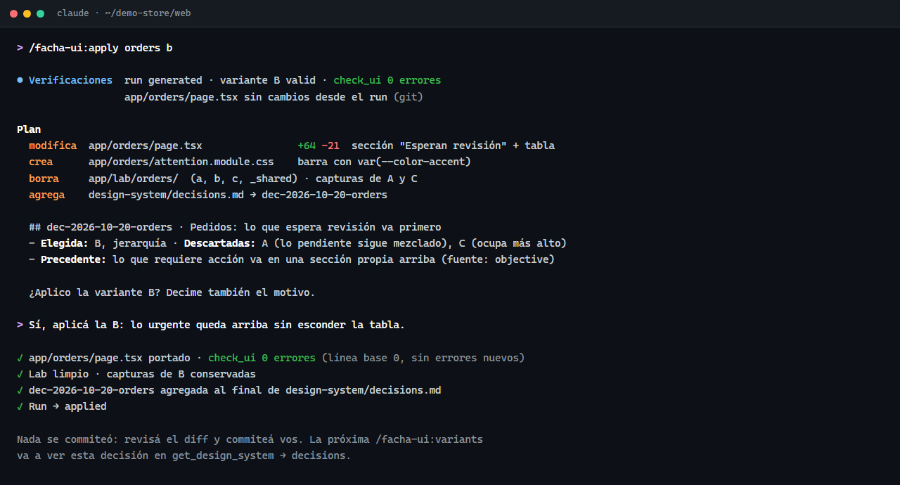

# Guía de uso del plugin facha-ui

Pasos para instalar facha-ui y usarlo en un proyecto React, desde la instalación hasta aplicar una variante. Para qué es y qué garantiza: [README](../README.md). Detalle técnico: [SPEC](../SPEC.md).

**Resumen del flujo:**

1. Instalar el plugin.
2. Verificar que los servidores MCP conecten.
3. Preparar el proyecto (raíz, config, `.gitignore`).
4. Diagnosticar el design system y las violaciones. Si faltan tokens, `/facha-ui:init` los propone desde lo que ya usás.
5. `/facha-ui:variants <pantalla> "<objetivo>"` → revisar las 3 variantes.
6. `/facha-ui:apply <slug> <a|b|c>` → aprobar el plan → revisar y commitear vos.


> Las imágenes de esta guía son **ilustrativas**: muestran una sesión de ejemplo sobre una app ficticia de pedidos ("Demo Store"). Los textos y los números de tu proyecto van a ser otros.

---

## 1. Requisitos

| Qué | Para qué |
|---|---|
| Claude Code con soporte de plugins | Skills y servidores MCP |
| Node ≥ 20 | Corre el MCP de facha-ui y Playwright MCP |
| Git | `apply` lo usa para saber si la pantalla cambió desde el run |
| Google Chrome (o `npx playwright install chromium`) | Capturas de las variantes |
| Proyecto Next.js con App Router | Único framework soportado por ahora |
| Tokens como CSS custom properties (`--panel`, `--text`, …) | Con o sin Tailwind 4 |

---

## 2. Instalar el plugin

Elegí una de estas tres opciones.

**A. Desde GitHub.** Dentro de Claude Code:

```text
/plugin marketplace add SebaFlockitDev/facha-ui
/plugin install facha-ui@facha-ui
```

**B. Desde una copia local del repo.** Dentro de Claude Code:

```text
/plugin marketplace add C:\ruta\a\facha-ui
/plugin install facha-ui@facha-ui
```

**C. Solo para una sesión, sin instalar nada:**

```bash
claude --plugin-dir "C:\ruta\a\facha-ui"
```

**Para todo el equipo:** commitear en el repo del proyecto `.claude/settings.json`. Cada dev recibe el plugin al abrir Claude Code en ese repo.

```json
{
  "extraKnownMarketplaces": { "facha-ui": { "source": { "source": "github", "repo": "SebaFlockitDev/facha-ui" } } },
  "enabledPlugins": { "facha-ui@facha-ui": true }
}
```

---

## 3. Verificar la instalación

1. Abrí Claude Code en la carpeta del frontend o en la raíz del repo: si hay un solo frontend, facha-ui lo encuentra solo (paso 4.1).
2. Corré `/mcp`. Tienen que aparecer dos servidores conectados:
   - `plugin:facha-ui:facha-ui`, el guardián, con 4 tools;
   - `plugin:facha-ui:playwright`, para las capturas. La primera vez tarda un poco más, porque descarga `@playwright/mcp@0.0.83`.
3. Corré `/facha-ui:help`. Tiene que mostrar los comandos, las tools y los archivos del plugin. También podés pedir una sola sección: `/facha-ui:help variants`, `apply`, `init`, `tools` o `files`.
4. Preguntale a Claude: *"¿qué design system tiene este proyecto?"*. Tiene que llamar a `get_design_system` y responder con los tokens, los temas y lo que falta.

Si algo de esto falla, mirá [Problemas frecuentes](#9-problemas-frecuentes).

---

## 4. Preparar el proyecto

### 4.1 Raíz del proyecto

facha-ui trabaja sobre la carpeta donde está el `package.json` del frontend. La resuelve en este orden:

1. la variable `FACHA_UI_ROOT` (absoluta, o relativa a la carpeta donde abriste Claude Code);
2. la carpeta donde abriste Claude Code, si es un proyecto (tiene `facha-ui.config.json` o un `package.json` con React);
3. si no, la busca sola hasta dos niveles más abajo, ignorando `node_modules` y carpetas ocultas. Si hay un solo frontend, lo usa y te lo avisa ("Project discovered at frontend/"). Si hay varios, las tools responden `MULTIPLE_PROJECTS` con la lista para que elijas.

En un monorepo con un solo frontend no hace falta nada. Con varios, abrí Claude Code en el que quieras o definí la variable antes de lanzarlo:

```powershell
$env:FACHA_UI_ROOT = "frontend"; claude
```

```bash
FACHA_UI_ROOT=frontend claude
```

### 4.2 Config (`facha-ui.config.json`)

Es opcional: sin config, facha-ui autodetecta e informa los supuestos que hizo. Conviene crearla en la raíz del frontend en cuanto los supuestos estén bien. Esta es la mínima:

```json
{
  "version": 1,
  "tokens": { "sources": ["app/globals.css"] },
  "preview": { "baseUrl": "http://localhost:3000" }
}
```

Claves útiles:

| Clave | Para qué | Default |
|---|---|---|
| `tokens.sources` | Archivos CSS con los tokens | Autodetectado |
| `tokens.themes` | Selector de cada tema, p. ej. `{ "light": ":root", "dark": "html.dark" }` | Autodetectado (`:root`, `.dark`, `html.dark`, `[data-theme=…]`) |
| `include` / `exclude` | Qué archivos audita `audit_project` | `app/**`, `components/**`, … |
| `contrast.surfaces` | Superficies contra las que se mide el contraste del texto | Autodetectado |
| `guidelines` | Reglas del equipo en texto libre; guían el diseño de las variantes | `[]` |
| `lab.dir` | Carpeta del laboratorio | `app/lab` |
| `preview.baseUrl` | URL del dev server (tiene que ser `localhost`, `127.0.0.1` o `::1`) | `http://localhost:3000` |
| `preview.auth` | `manual` si la app pide login (lo hacés vos) | `none` |
| `memory.decisionsFile` | Dónde `apply` registra las decisiones | `design-system/decisions.md` |

Ejemplo completo: SPEC, Anexo A. Si la config tiene un error, las tools responden `CONFIG_INVALID` con la ruta exacta del campo.

### 4.3 `.gitignore`

facha-ui nunca edita el `.gitignore`. Agregá a mano lo que no quieras versionar:

```gitignore
app/lab/
.facha-ui/
```

El laboratorio igual devuelve 404 en producción, pero no conviene que llegue a `main`. Si abrís Claude Code en la raíz de un monorepo, Playwright deja sus archivos automáticos en `.facha-ui/playwright/` de esa carpeta: ignorala también en el `.gitignore` de la raíz.

---

## 5. Diagnosticar

Antes de pedir variantes, conviene saber en qué estado está el design system. Ejemplos de pedidos:

| Pedido | Tool | Qué devuelve |
|---|---|---|
| *"¿Qué design system tiene este proyecto?"* | `get_design_system` | Tokens por tema, clases reutilizables, `coverage` (roles que faltan), `gaps` (literales sin token), `health` (contraste por tema), `guidelines` y `decisions` |
| *"¿Qué color uso para X?"* | `get_design_system` | El token, o la aclaración de que no existe y cuál es la alternativa |
| *"Revisá `app/orders/page.tsx`"* | `check_ui` | Violaciones con archivo:línea, severidad y sugerencia de token |
| *"¿Cuántas violaciones tiene el proyecto?"* | `audit_project` | Totales por severidad, por regla y por archivo |
| *"¿Qué tokens le faltan a este proyecto?"* | `scan_styles` | Propuesta de tokens a partir de los valores en uso, con valor por tema, contraste y plan de migración |

`status` puede tener tres valores:

- **`ok`:** el proyecto cumple el contrato mínimo.
- **`partial`:** faltan roles opcionales. `variants` funciona igual y avisa lo que falta.
- **`missing`:** no hay tokens. `variants` se niega a generar, porque sin tokens la IA solo podría inventar.

**Qué revisa el guardián** (`check_ui` y `audit_project`):

| Regla | Severidad | Detecta |
|---|---|---|
| `color-literal` | error | Colores escritos a mano en vez de tokens |
| `tailwind-arbitrary-value` | error (warning para tamaños de layout; info si el valor es un token) | Valores sueltos como `text-[13px]` |
| `unknown-token` | error | `var(--x)` de un token que no existe |
| `inline-style` | info | `style={{…}}`: falta una clase o un patrón |
| `theme-contrast` | error si el fondo es conocido, warning si no | Un texto que no llega a 4.5:1 contra su fondo en algún tema. Sugiere un token legible en todos los temas |
| `class-contrast` | igual que la anterior | Una clase del CSS cuyo color de texto falla, marcada en cada componente que la usa |
| `non-text-contrast` | warning | Bordes de campos y botones, anillos de foco e íconos por debajo de 3:1 (WCAG 1.4.11) |

Además, `health` (en `get_design_system` y `audit_project`) informa los tokens de texto que fallan contraste y los **estados que se confunden por color**, también simulando deuteranopía y protanopía. Si querés que los contrastes contra las superficies sean errores, declaralas en la config: `"contrast": { "surfaces": ["--panel"] }`.

### 5.1 Si faltan tokens: `/facha-ui:init`

Cuando el design system no existe o le faltan roles, como los colores de estado, `/facha-ui:init` te ayuda a crearlos **sin inventar**:

```text
/facha-ui:init
```

1. **Releva lo que ya usás.** La tool `scan_styles` encuentra los colores escritos a mano y los agrupa por uso (fondo, texto, borde) y por significado (estado, texto sobre acento, hover), según los selectores donde aparecen. Con `/facha-ui:init scales` también propone escalas de tamaños de letra y radios, fusionando valores casi iguales.
2. **Te propone tokens.** Cada propuesta trae:
   - un nombre;
   - el valor del tema por defecto, que es el que ya está en uso;
   - el valor de cada tema extra: lo que el proyecto ya declara o, si no hay, uno derivado con contraste verificado, con la explicación de cómo se obtuvo;
   - el contraste;
   - los lugares donde se usa.

   Los colores que ya coinciden con un token existente se migran a ese token, sin crear uno nuevo.
3. **Vos decidís.** Podés crear todo o una parte, cambiar nombres o valores, y elegir si además se reemplazan los literales. Aprobás con un motivo, igual que en `apply`.
4. **Escribe y valida.** Agrega los tokens a tu archivo de tokens (nunca cambia ni borra los existentes), migra las líneas aprobadas, compara `audit_project` antes y después, y registra la decisión en `decisions.md`. No commitea.

Desde ese momento, `get_design_system` devuelve los tokens nuevos y `variants` los usa.

---

## 6. Generar variantes

### 6.1 Antes de empezar

1. Levantá la app (`npm run dev`) en la URL de `preview.baseUrl`.
2. Si la app pide login, poné `"auth": "manual"` en `preview` en la config: vas a iniciar sesión vos cuando aparezca la ventana de Playwright.
3. Si la pantalla toma datos de una API, asegurate de que haya datos que muestren el caso. Las variantes usan los datos reales, no mocks.

### 6.2 Pedirlas

```text
/facha-ui:variants <pantalla> "<objetivo>"
```

- `<pantalla>` puede ser una ruta (`/orders`), un archivo (`app/orders/page.tsx`) o un componente (`components/OrderCard.tsx`).
- `<objetivo>` es texto libre: *"que se vea primero lo que espera revisión"*.

Ejemplo:

```text
/facha-ui:variants /orders "que se vean primero los pedidos pendientes de revisión"
```

### 6.3 Qué hace la skill

1. **Preflight:** lee el design system. Si no hay tokens, si el framework no es Next o si ya hay un run sin aplicar de esa pantalla, frena y te pregunta.
2. **Línea base:** lee la pantalla y sus dependencias, y corre `check_ui` sobre el original.
3. **Brechas, antes de generar:** si el objetivo necesita algo que no tiene token (p. ej. un color de estado), te lo dice con evidencia y explica cómo lo van a resolver las variantes con tokens existentes. Crear tokens es una decisión del equipo; la skill nunca lo hace.
4. **Tres hipótesis distintas:**
   - **A, conservadora:** misma estructura, con el objetivo resuelto y la línea base corregida;
   - **B, jerarquía:** reorganiza la información según el objetivo;
   - **C, patrón alternativo:** otro patrón armado con piezas existentes.
5. **Escritura en el laboratorio:** `app/lab/<slug>/<a|b|c>/page.tsx`, con el código compartido en `_shared/`. La primera vez agrega el andamiaje (`app/lab/layout.tsx` y `lab-theme.tsx`). Cada escritura pasa por los permisos de Claude Code: la ves y la aprobás.
6. **Guardián:** cada variante pasa por `check_ui` hasta tener 0 errores, con un máximo de 3 intentos. Si no lo logra, queda como `failed` y no se puede aplicar.
7. **Capturas:** en light y en cada tema extra, con Playwright. Si Playwright no llega a la app después de 2 intentos, la skill te pasa las URLs para que las mires a mano.
8. **Presentación:** para cada variante, hipótesis, resultado del guardián, decisiones con su fuente (token, clase, guideline, decisión previa…) y trade-offs.

Así se ve una corrida en la terminal. En este ejemplo, la brecha aparece antes de generar: no hay tokens de estado. Además, el guardián rechaza el primer intento de A y de C, y los dos pasan en el segundo.



### 6.4 Revisar el resultado

- **Variantes en el navegador:** `http://localhost:3000/lab/<slug>/<a|b|c>`. Para el tema oscuro, agregá `?theme=dark` (o el nombre del tema).
- **Run:** `.facha-ui/runs/<slug>.json`, con hipótesis, intentos del guardián, decisiones con fuente, brechas y hallazgos.
- **Capturas:** `.facha-ui/screenshots/<slug>/`, con un archivo por variante y tema (por ejemplo `a-desktop-dark.png`).

Las tres variantes del ejemplo, en `/lab/orders/<a|b|c>`:

| A · Conservadora | B · Jerarquía | C · Patrón alternativo |
|---|---|---|
| [](img/variante-a.png) | [](img/variante-b.png) | [](img/variante-c.png) |
| Aviso con el total pendiente y barra de acento en esas filas. Cambia lo mínimo. | Sección propia arriba, los más antiguos primero. Lo pendiente aparece dos veces. | Una tarjeta por pedido pendiente. Es la que más cambia la pantalla. |

Revisá siempre el tema oscuro (`?theme=dark`). En la variante B en dark, el badge "Pendiente de revisión" queda claro sobre el fondo oscuro, porque usa colores literales sin variante dark. Es la brecha que la skill avisó antes de generar, y por eso las variantes marcan lo pendiente con la barra de `--color-accent` y no con un color nuevo.



Si no te convence ninguna, podés pedir ajustes en la misma conversación ("en la B, el resumen va arriba de los filtros"). La skill los valida de nuevo con el guardián.

---

## 7. Aplicar una variante

### 7.1 Pedirlo

```text
/facha-ui:apply <slug> <a|b|c>
```

Ejemplo: `/facha-ui:apply orders b`. Solo lo podés lanzar vos: Claude no puede invocarla por su cuenta.

### 7.2 Qué pasa

1. **Verificaciones, sin escribir nada:**
   - el run tiene que estar sin aplicar y la variante tiene que ser `valid`;
   - el guardián se corre de nuevo sobre la variante;
   - git dice si la pantalla original tiene cambios sin commitear o cambió después del run.
2. **Plan exacto:**
   - archivos que cambian (con resumen del diff) y archivos que se crean;
   - archivos que se borran (el lab de esa pantalla y las capturas descartadas);
   - la entrada completa que se agrega a `decisions.md`.
3. **Tu aprobación y el motivo.** Respondé nombrando la variante y diciendo por qué, por ejemplo: *"Sí, aplicá la B: deja lo urgente arriba sin esconder la tabla"*. Una respuesta ambigua ("ok", "dale") se repregunta. Si el plan cambia, te lo vuelve a mostrar.
4. **Aplicación y validación:** porta la variante a la pantalla real y corre `check_ui`. No puede haber errores nuevos respecto de la línea base. Si los hay, no limpia nada y te ofrece revertir.
5. **Limpieza:** borra el lab de esa pantalla, las capturas descartadas y el andamiaje si no quedan otros runs.
6. **Memoria:** agrega la decisión al final de `decisions.md` (por ejemplo, `dec-2026-10-20-orders`) y marca el run como `applied`.



### 7.3 Después de aplicar

- Revisá el diff y probá la pantalla. **facha-ui no commitea**: el commit lo hacés vos.
- La próxima vez que corras `variants` sobre cualquier pantalla, la decisión aparece en `get_design_system` → `decisions`, y las variantes pueden citarla como fuente.

### 7.4 Descartar sin aplicar

`apply` todavía no tiene `--discard`. Tenés dos formas:

- volver a correr `/facha-ui:variants` sobre la misma pantalla y aceptar descartar el run anterior cuando lo pregunte;
- borrar a mano `app/lab/<slug>/` y `.facha-ui/runs/<slug>.json`.

---

## 8. Uso cotidiano

No hace falta usar `variants` para todo. Con el plugin activo, el MCP le indica a Claude que consulte `get_design_system` antes de escribir UI y que corra `check_ui` después. Un pedido común ("agregá un filtro por canal") ya sale con tokens del proyecto y validado.

Atajos útiles:

- *"Corré check_ui sobre lo que cambiaste"*: antes de commitear.
- *"Auditá el proyecto y mostrame los 5 archivos con más errores"*: para planificar una limpieza.

---

## 9. Problemas frecuentes

| Síntoma | Causa probable | Qué hacer |
|---|---|---|
| `/mcp` muestra `facha-ui` desconectado | Node < 20, o el plugin no está instalado | `node --version`; reinstalá el plugin |
| `PROJECT_NOT_FOUND` o tokens vacíos | Claude Code se abrió en una carpeta que no contiene el frontend | Abrilo en el frontend o usá `FACHA_UI_ROOT` (paso 4.1) |
| `MULTIPLE_PROJECTS` | Hay más de un frontend debajo de la carpeta abierta | Abrí Claude Code en el que quieras o usá `FACHA_UI_ROOT` (paso 4.1) |
| `CONFIG_INVALID` | Clave mal escrita o valor inválido en la config | El error indica el campo exacto. `preview.baseUrl` tiene que ser loopback |
| `PATH_OUTSIDE_PROJECT` | Le pediste revisar un archivo fuera del frontend | Usá rutas dentro de la raíz del proyecto |
| `variants` no genera (`status: missing`) | El proyecto no tiene tokens | Corré `/facha-ui:init` para proponerlos desde los valores en uso (paso 5.1) |
| Las capturas no salen | Chrome no está instalado, o el dev server no está levantado | Instalá Chrome o `npx playwright install chromium`; levantá la app; si no, usá las URLs que lista la skill |
| La captura muestra el login | La app pide sesión | Poné `preview.auth: "manual"` e iniciá sesión vos en la ventana de Playwright |
| `?theme=dark` no cambia nada | El tema se define con `@media (prefers-color-scheme)` | No se puede forzar desde la página: usá la emulación de color del navegador |
| `/lab/...` da 404 | La app corre en modo producción | El lab solo existe con `npm run dev` |
| `apply` dice que la pantalla cambió | Hubo commits o cambios en el original después del run | Confirmá explícitamente o generá un run nuevo |

---

## 10. Referencia rápida

| Comando | Quién lo invoca | Escribe |
|---|---|---|
| `/facha-ui:variants <pantalla> "<objetivo>"` | Vos, o Claude cuando pedís "variantes" o "alternativas" | Solo `app/lab/` y `.facha-ui/` |
| `/facha-ui:apply <slug> <a\|b\|c>` | Solo vos | La pantalla elegida, `decisions.md` (al final) y el run, después de tu aprobación |
| `/facha-ui:init [colors\|scales\|all]` | Solo vos | Tokens nuevos (solo agrega), las líneas migradas y `decisions.md`, después de tu aprobación |
| `/facha-ui:help [variants\|apply\|init\|tools\|files]` | Solo vos | Nada: solo muestra esta referencia |

| Tool MCP | Hace |
|---|---|
| `get_design_system` | Lee tokens, temas, clases, cobertura, brechas, contraste, guidelines y decisiones |
| `check_ui` | Valida un archivo o una carpeta |
| `audit_project` | Audita todo el proyecto (sin el lab) |
| `scan_styles` | Propone tokens a partir de los valores que el proyecto ya usa (no escribe) |

| Archivo | Qué es |
|---|---|
| `facha-ui.config.json` | Config del proyecto |
| `app/lab/<slug>/<x>/page.tsx` | Variantes (solo en desarrollo) |
| `.facha-ui/runs/<slug>.json` | Estado del run: hipótesis, intentos, decisiones, brechas |
| `.facha-ui/screenshots/<slug>/` | Capturas por variante y tema |
| `.facha-ui/playwright/` | Archivos automáticos de Playwright, como los logs de consola (en la carpeta donde abriste Claude Code) |
| `design-system/decisions.md` | Memoria de decisiones aprobadas |
